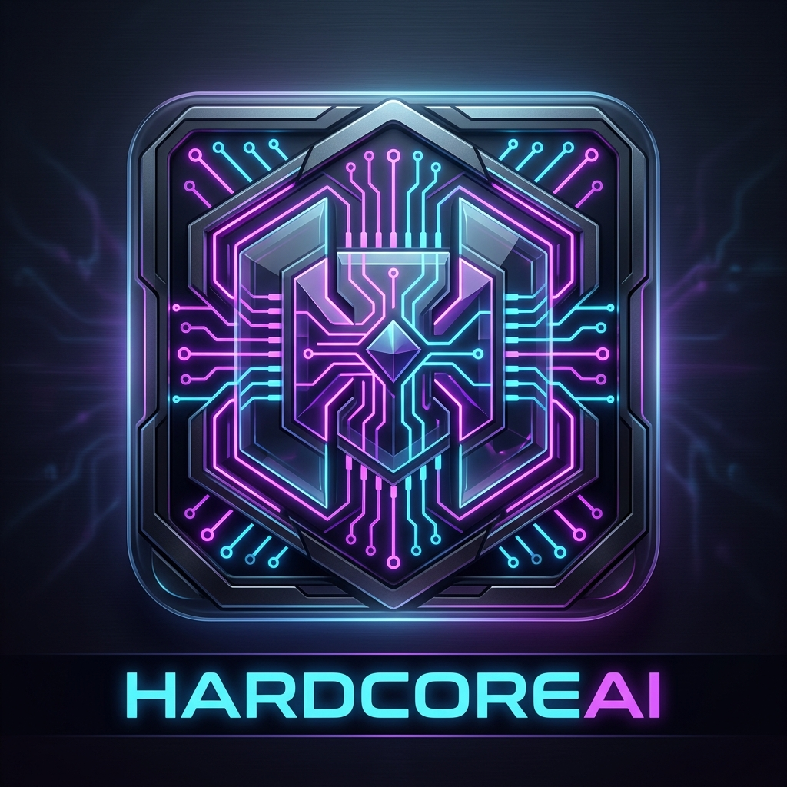

  

# HARDCOREAI
### The "Cursor" for Embedded Systems Engineers - Production Grade Debug & Firmware Platform

**HARDCOREAI** transforms your modern VS Code environment into a high-fidelity hardware intelligence station. It bridges the gap between raw hardware signals and actionable engineering fixes using a specialized "Cyber-Industrial" logic engine.

## 🚀 Key Features

*   **💥 Immediate Vector Catch**: Capture the exact microsecond of a HardFault. Unlike standard debuggers that stop *after* the crash, HARDCOREAI freezes the CPU at the point of impact, preserving critical register data.
*   **🧠 Intelligence Layer**: High-resilience AI analysis grounded in deterministic hardware facts. Explains root causes like Peripheral Clock Gating, Stack Corruption, and Bus Alignment issues.
*   **🛠 One-Click Diagnostics**: Point to a `fault.json` or connect to live hardware to get a multi-lane report including Identity, Intelligence, and Actionable Fixes.
*   **🔭 Zero-Touch Monitor**: Set up OpenOCD traps automatically and watch the Dashboard pop up the moment your firmware hits a snag.

## 🕹 Commands

*   `HARDCOREAI: Start Live Hardware Monitor`: Launches a persistent hardware trap using Vector Catch.
*   `HARDCOREAI: Analyze Current Project`: Automatic deep-scan of your workspace for crash dumps.
*   `HARDCOREAI: Decode HardFault`: Manual entry for decoding existing hardware logs into high-fidelity reports.

## 💻 Tech Stack Support

*   **Architectures**: ARM Cortex-M, RISC-V, Xtensa, AVR.
*   **MCUs**: STM32, nRF52, ESP32, Kinetis, SAM, etc.
*   **Bridges**: ST-Link, J-Link, ESP-Prog (via OpenOCD).

---
*Created by Embedded Engineers, for Embedded Engineers. No more manual register decoding.*
